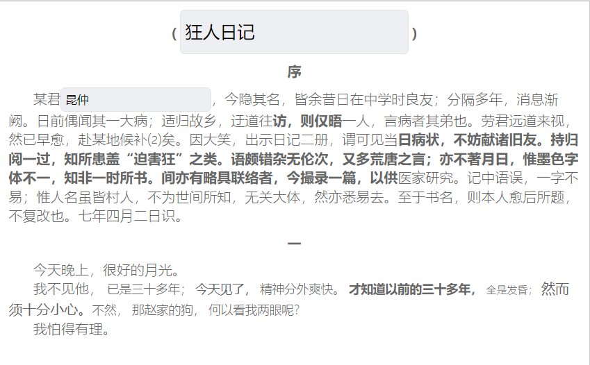

### R-Editor(rhapsody-editor)

#### 基于Vue3混合结构化数据的富文本编辑器

A rich text editor based on Vue3 mixed structured data

No English Explain,sorry

---

###### 一、功能

1. 此富文本编辑器能够使用基本的文字编辑添加样式，还能够使用输入“#”+ 对应搜索名称的形式来显示出一个列表，列表展示内容为需要的编辑类型组件名，也就是这里的组件可以插入到富文本编辑器中，至于导入的组件可自定义为自己想要的，不论你是使用element-ui的el-input还是使用ant-design的input或者其他库的组件，又或者是其他的输入形式的组件，不论是输入框，还是选择框，或者下拉列表等，只要导入引用就可以使用；
2. 导出的数据将会是一个三级节点json格式形式存在，你将可以使用此结构数据提取出能够使用的信息（比如分析或提取出关键词），这里已经区分了普通文本和组件内容；
3. 若对此插件有不明白的可执行 `npm run dev`查看和查看example内的示例；

---

###### 二、引用及配置

1. 开始，请运行代码安装此插件：

   ```
   npm i rhapsody-editor -S
   ```
2. 然后进行引用：

   局部引用，在setup中直接引用即可：

   ```javascript
   import { REditor } from 'r-editor';
   ```

   全局引用：

   ```javascript
   // 全局引用方式参考下方use(REditor)
   import REditor from 'r-editor';
   createApp(App).use(REditor).mount('#app');  
   ```
3. 参数配置，如果想看看效果可运行当前项目来启动example的示例，其内部App.vue将会有配置参考，

   | 参数     | 类型    | 是否必填 | 说明                                                                                                              |
   | -------- | ------- | -------- | ----------------------------------------------------------------------------------------------------------------- |
   | openEdit | Boolean | 是       | 是否开启编辑模式，参数为true则为编辑模式可编辑内容，<br />参数为false则为预览模式，不可编辑，但可查看最终预览效果 |
   | configs  | Object  | 是       | 配置参数，请参考下方配置详情                                                                                      |

   下方将列出configs中的现有配置参数并解释：

   | 参数                | 类型   | 是否必填 | 说明                                                                                                                                                     |
   | ------------------- | ------ | -------- | -------------------------------------------------------------------------------------------------------------------------------------------------------- |
   | baseData            | Object | 是       | json格式的数据，用于展示初始化之后的基本内容(计划参数)                                                                                                   |
   | data                | Object | 是       | json格式的数据，用于展示初始化之后的内容                                                                                                                 |
   | components          | Array  | 是       | 需要引用的编辑组件，也就是使用'#'号选择的内容，是一个列表，<br />后边将列出components的配置内容                                                          |
   | historyStackLength  | Number | 否       | 历史栈的长度，默认20，解释：比如如果设置为10，<br />那么在编辑时，操作20次后可回退到最初位置，但是<br />如果操作了21次，将只能回退20次，而不能回退到最初 |
   | inputRecordInterval | Number | 否       | 输入内容节流时间，用于控制历史栈存储，默认300ms<br />，300ms内连续输入的内容为一个历史栈                                                                 |

   下方将列出components中的参数及说明：

   | 参数          | 类型    | 是否必填 | 说明                                                                                                                      |
   | ------------- | ------- | -------- | ------------------------------------------------------------------------------------------------------------------------- |
   | type          | String  | 是       | 当前components组件内type唯一，标识当前组件类型名                                                                          |
   | key           | String  | 是       | 当前组件绑定参数key，参数内容唯一，可用于后续数据收集和分析                                                               |
   | name          | String  | 是       | 当前组件展示名称，参数内容唯一，用于展示选择项名称，方便选择                                                              |
   | component     | Object  | 是       | **类型为组件形式，用于在使用时所展示的组件，需要自己写**                                                            |
   | otherData     | Object  | 否       | 存储其他数据，根据需要进行使用，比如示例中的selectOptions，<br />将存储当前下拉选择框的选项，根据自定义的组件进行配合使用 |
   | isNotMenuItem | Boolean | 否       | 默认false，用于判定当前插件是否只在输入'#'号时展示的<br />菜单中，因为若是文本插件将不需要在菜单中显示                    |

###### 三、方法调用

| 方法名       | 参数/回调          | 解释                                                                                                                           |
| ------------ | ------------------ | ------------------------------------------------------------------------------------------------------------------------------ |
| revokeData   | -                  | 调用一次即撤销一步，若无旧的历史栈数据则无效果                                                                                 |
| recoveryData | -                  | 调用一次即前进一步，若无新的历史栈内容则无效果                                                                                 |
| importData   | 一个文档结构的数据 | 调用一次并传入文档数据，则替换当前展示文档内容<br />，参考输出格式，可以参考输出格式，内容部分为<br />开发自定义数据及组件内容 |
| exportData   | callback，一个回调 | 导出当前文档数据，callback中的回调参数为文档的结构数据                                                                         |

###### 四、基本配置示例

```javascript
<template>
  <REditor :openEdit="openEdit" :configs="configs" ref="editorRef" />
</template>
<script setup>
import { ref, nextTick } from 'vue';
import 'r-editor/lib/style.css';
import { REditor } from "r-editor";
import baseData from "@/test-data/base.json";

const editorRef = ref(null);
const openEdit = ref(true);
const data = baseData;
const configs = {
  baseData,
  data,
  components: [],
  historyStackLength: 40,
  inputRecordInterval: 350,
};

nextTick(() => {
  editorRef.value.defineExpose(data => {
    console.log('查看导出的文档数据', data);
  })
})
</script>
```

###### 五、输入类型组件外层封装结构示例及解释

```javascript
<template lang="pug">
//- 1
template(v-if='!openEdit') {{ inputValue }}
//- 2
span(v-else data-type="editor-input", contenteditable='true', :data-value="inputValue", :data-placeholder="placeholder", :data-style="JSON.stringify(outData.data.style)", :data-other-data="JSON.stringify(outData.data.otherData)")
    //- 3
    input(type="text", class="editor-input",:placeholder="placeholder", v-model="inputValue", :style='style')
</template>
<script setup>
import { ref } from 'vue';
import { isType, transformStyle } from '../../utils';
const outData = defineProps({
    openEdit: {
        type: Boolean,
        default: true,
        required: true,
        validator: val => {
            return isType(val, 'Boolean');
        }
    },
    data: {
        type: Object,
        required: true,
        validator: val => {
            return isType(val, 'Object');
        }
    }
});

const inputValue = ref(outData.data.value);
const placeholder = outData.data.placeholder || '';
const style = transformStyle(outData.data.style);
</script>
<style lang="sass">
span[data-type="editor-input"]
    font-size: 14px
    .editor-input
        border: 0
        min-width: 30px
        border-radius: 5px
        background-color: #eeeff3
        padding: 5px
        outline: 1px solid #e2e2e2
</style>

```

以上解释：

1. 注释1处判定当前编辑器是否处于编辑状态，若否则可以展示组件的普通文本，这里可以根据自己需要进行处理；若是看下一个注释；
2. 注释2处判定若处于编辑模式，则需要按照外层span标签且是规范的参数来套一层，内层也就是注释3，可以放对应的组件，不论是element-ui的input等组件，或者vant的一些，只要是ui组件都可以方放入，但是外层必须是span，至于此交互组件的逻辑可以自行编辑处理，外层span的参数以下解释：

   | 参数                   | 类型                              | 解释                                                                                                                                                                         |
   | ---------------------- | --------------------------------- | ---------------------------------------------------------------------------------------------------------------------------------------------------------------------------- |
   | data-type              | String                            | 对应当前组件，不仅用于标记当前组件类型生成json数据，<br />在倒入数据时需要识别此类型组件生成                                                                                 |
   | contenteditable='true' | -                                 | 默认值，需要设定，但是不需要修改，用于针对当前组件<br />可被删除功能使用                                                                                                     |
   | data-value             | String/Boolean<br />Number/Object | 当前组件中绑定的输入值，根据需要来组织，可以是一个字符串<br />，也可以是一个json, 比如当前组件要是一个table，其绑定 <br />的值就很多了                                       |
   | data-placeholder       | String                            | 针对文本输入的组件展示的默认提示                                                                                                                                             |
   | data-style             | String                            | json转字符串化的样式，暂时交互组件的样式未开发<br />，文本组件已有，如果你能够自己写 <br />调组件样式的也不是不可以 样式为当前内容展示的样式，<br />对于文本组件来说是必须的 |
   | data-other-data        | String                            | json格式化的附属参数，内部参数名自定义，属于扩充参数<br />，比如多选框或者下拉列表的参数集合，这里就可以存储这些 <br />参数了                                                |
3. 注释4 这里参数有两个需要导入的，一个是openEdit和一个data，其中data中的参数是根据当前组件的类型及参数来定的：

   ```json
   {
       "type": "editor-input",
       "style": {
           "font-size": "20px",
           "width": "80px",
           "line-height": "40px"
       },
       "value": "狂人日记", 
       "placeholder": "请输入",
       "otherData": {
       }
   },
   ```

###### 六、最终效果展示


